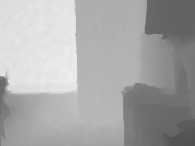

# Scene Representations from Focal Stack for Depth Estimation
Contact: Logan Bruns <logan@gedanken.org>

### Abstract from project paper

  This project explores the use of focal stacks as deep learning scene
  representation embeddings to improve depth estimation with or
  without the focal stack at inference time. The general approach
  taken was to train a deep learning model to first create a scene
  embedding for each image and its focal length in the focal
  stack. These scene embeddings are then used to create a single
  combined scene embedding which is then sent through a decoder
  network to predict the depth map. The intuition is that this allows
  the network to learn the depth cues from varying blur in each image
  along with its focal length. More training would be desirable as the
  test performance is still improving but a few promising conclusions
  seem evident. The deep learning model is able to learn from the blur
  depth cues in the focal stack. Beyond learning how to render the
  depth map from the focal stack it also appears to have learned a
  prior on the common features of the depth maps such as the
  walls. This prior can improve on the sensory gathered depth maps
  much as a human's grounding would be able to guess what would be in
  shadow based on what can be seen.
  
### Example predictions

| Original Image | Predicted Depth Map | Measured Depth Map |
|  |  |  |
|  |  |  |
|  |  |  |
  
### Repository layout

#### Source files

_Makefile_: top level makefile to run training and start tensorboard

_deepdepth.py_: main script containing training loop

_depth\_model.py_: model class containing model architecture and losses

_data\_transforms.py_: dataset transforms for creating features and augmenting data

_nyu.py_: NYUv2 dataset loader

_mat2h5.m_: matlab script to help convert data

_h52tfrecord.py_: script to convert hdf5 data into tfrecord

_nyu2nyufocal.py_: script to compute focal stacks

_environment[-mac].yml_: conda environment yaml for creating python virtual environment

#### Directories

_data/_ directory to download dataset to and store transformed forms

_experiments/_ directory to hold experiment checkpoints and tensorboard logs

### Environment preparation steps

```
$ conda create --name deepdepth --file environment.yml
$ conda activate deepdepth
```

### Data preparation steps

#### Download NYUv2 depth labeled dataset (matlab data file)
```
$ cd data
$ wget http://horatio.cs.nyu.edu/mit/silberman/nyu_depth_v2/nyu_depth_v2_labeled.mat
```

#### Convert Matlab data file into h5 format
Run the mat2h5.m script which will generate nyu\_depth\_v2.h5 file in the data directory.

#### Convert h5 format into tfrecord format

```
$ python h52tfrecord.py
```

This will generate the nyu\_depth\_v2.tfrecord file in the data directory.

#### Add precomputed focal stack to dataset

```
$ python nyu2nyufocal.py
```

This will generate the nyu\_focal\_stack.tfrecord file in the data directory.

#### Compress and shard dataset

```
$ python compress_and_shard.py
```

This will generate the compressed\_nyu\_focal\_stack\_*.tfrecord files in the data directory.

#### Split dataset into training, validation, and test

```
$ mkdir data/train data/val data/test
$ mv data/compressed_nyu_focal_stack_8?.tfrecord data/val
$ mv data/compressed_nyu_focal_stack_9?.tfrecord data/test
$ mv data/compressed_nyu_focal_stack_*.tfrecord data/train
```

### Training steps

#### Start tensorboard

```
$ make tensorboard
```

#### Start training

```
$ make train
```

#### Monitor training and results in tensorboard

Go to http://localhost:6006/ or http://hostname:6006/ and click images
tab to see examples of the context images, predictions, and ground
truth.

